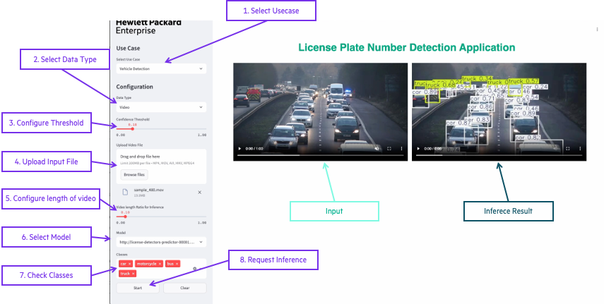
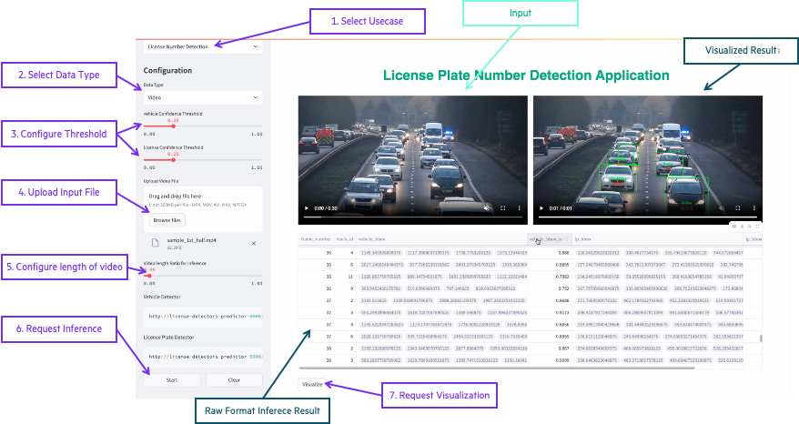

# License Plate Number Detection

## Overview

Object Detection and Image recognition is one of the most popular area in AI. Among its various use cases, **Automatic Number Plate Recognition (ANPR)** stands out as a critical application that leverages object detection and image recognition. From traffic management to law enforcement and parking automation, ANPR systems are solving various challenges. This demo will demonstrate How can ANPR be implemented with PCAI.

## Contents
- **notebooks** : End-to-End Walk-Through Demonstration for License Plate Number Detection. 
- **frontend** : Simple web interface for License Plate Number Detection application. Implemented by Streamlit
- **backend** : Backend for License Plate Number Detection application. Implemented by FastAPI
- **models** : Finetuned license plate detection model and TensorRT engine for Application. 
- **helm** : Helm chart for License Plate Number Detection application.


## How to Use Applications
### Use Case 1. Object Detection


1. Select Vehicle Detection Usecase
2. Select Data type ( Image or Video )
3. Configure Confidence Threshold
4. Upload Input File. ( If you select video type, Please configure Video Length Ratio for Inference. )
5. Select Model ( Vehicle Detector or License Plate Detector )
6. Check target Classes
7. Click Start

### Use Case 2. License Plate Number Detection


1. Select License Number Detection Usecase
2. Select Data type ( Image or Video )
3. Configure Confidence Threshold for each model
4. Upload Input File. ( If you select video type, Please configure Video Length Ratio for Inference.
5. Click Start to request inference. it will return Raw format Inference Result as DataFrame format
6. Click Visualize to request Visualization. it will return Visualized Result by Image or Video.


## How License Plate Number Detection is processed

In order to ensure that the OCR model focuses only on license plate, we will first detect the license plates. To make the license detection more robust, we will also leverage vehicle detection. Here is a High level overview of the process.


1. Read Input. ( Frame or Image )
2. Detect Vehicle
3. crop the detected vehicles
4. Detect License Plate from cropped vehicle images
5. Crop the detected license plates
6. Read License Plate Number from cropped license plate images. 

---

## Installation Methods

### Quick Start locally

1. Clone the repository:
   ```sh
   git clone https://github.com/ai-solution-eng/ai-solution-demos.git
   cd license-plate-number-detection 
   ```

2. Start Backend application:
    ```sh
    # Install Dependencies
    cd backend
    pip install -r requirements.txt

    # Run Application
    uvicorn main:app
    ```

2. Start Frontend application:
    ```sh
    # Install Dependencies
    cd frontend
    pip install -r requirements.txt

    # Run Application
    streamlit run main.py
    ```

3. Access the application at [http://localhost:8501](http://localhost:8501)

4. (Optional) For testing API, Access the Swagger page at [http://localhost:8000](http://localhost:8000)

### HPE PCAI Deployment

The application is designed to be deployed on HPE's Private Cloud AI (PCAI) using AIE's Import Framework feature. The provided Helm chart simplifies the deployment process and includes all necessary Kubernetes resources.

1. Get the Helm chart from [here](https://github.com/ai-solution-eng/ai-solution-demos/tree/main/license-plate-number-detection/helm)
2. Log in to your HPE PCAI environment (AIE)
3. Navigate to **“Tools & Frameworks”**
4. Select **"Import Framework"**
5. Fill in the framework details:
   - **Framework Name** : A short name for the framework
   - **Description** : Brief description
   - **Category** : Select appropriate category (e.g., "Data Science")
   - **Framework Icon** : Upload an icon for the application (sample icon included in the project)
   - **Helm Chart → Upload Helm Package File (tar.gz, tgz)** : Upload the packaged chart
   - **Namespace** : Target namespace for deployment
   - (Optional) Release Name: Custom release name
   - **Configure Values.yaml** : Review your values.yaml content and Configure Model Deployment. ( **Required** )
      - Use MLIS Deployment ( **Recommended** )
        ```yaml
        backend:
          appConfig:
            detectors:       
              option : "mlis"
              mlis_deployment_name : "license-detectors"
              mlis_deployment_namespace : <MLIS deployment Namespace>
              server_token: <MLIS Token>
        ```
      - Use embedded model in container image. ( with CPU )
        ```yaml
        backend:
          appConfig:
            detectors:       
              option : "embedded"
              server_token: ""
              vehicle_detector : "yolo11s.pt" 
              license_detector : "yolo11s_20epochs_best.pt"
        ```
6. Click "Submit" to deploy


### MLIS Integration

To use PCAI's Machine Learning Inference Service (MLIS):
1. Follow the steps in the notebooks. ([link](https://github.com/ai-solution-eng/ai-solution-demos/tree/main/license-plate-number-detection/notebooks))
2. Configure the generated MLIS Deployment Name and API key in the values.yaml. ( if you want to deploy the application without MLIS integration, Use **embedded** option for **backend.appConfig.detectors.option**. )
3. The application will automatically handle the integration with the MLIS-hosted model


### Helm Chart Reference

The Helm chart includes the following configurable parameters:

|Parameter|Description|Values|
|:---|:---|:---|
|frontend.appConfig.logo_url|Configure the App Logo|assets/hpe_pri_grn_pos_rgb.png or A URL (string) for a hosted image.|
|backend.appConfig.detectors.option|Detector deployment type|mlis or embedded|
|backend.appConfig.detectors.mlis_deployment_name|MLIS Deployment Name|license-detectors|
|backend.appConfig.detectors.mlis_deployment_namespace|MLIS Deployment Namespace|User Namespace in PCAI|
|backend.appConfig.detectors.server_token|MLIS Token for Detector deployment|MLIS Token|
|backend.appConfig.detectors.vehicle_detector|Model Name for Vehicle detection|vehicle_detector or yolo11s.pt|
|backend.appConfig.detectors.license_detector|Model Name for license plate detection|license_detector or yolo11s_20epochs_best.pt|
|ezua.virtualService.endpoint|Virtual service hostname|lp-number-detection.${DOMAIN_NAME}|
|ezua.virtualService.istioGateway|Istio gateway reference|istio-system/ezaf-gateway|

---

## Project References
|Components|Notes|
|:---|:---|
|Ultralytics ([link](https://github.com/ultralytics/ultralytics))|Provide Object Detection Model and Training, inferencing, Model Conversion, Benchmark utilities.|
|EasyOCR ([link](https://github.com/JaidedAI/EasyOCR))|Provide OCR Capability. |
|Roboflow ([link](https://universe.roboflow.com/roboflow-universe-projects/license-plate-recognition-rxg4e))|License Plate datasets|
|computervisioneng ([link](https://github.com/computervisioneng/automatic-number-plate-recognition-python-yolov8))|Reference for License Plate Number Detection process|
|Video by Mike Bird on Pexels ([link](https://www.pexels.com/video/traffic-flow-in-the-highway-2103099/))|Sample traffic video used in demo|